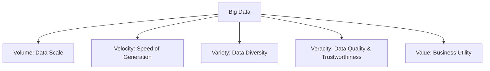

### What is Big Data?
**Big Data** refers to datasets whose size, complexity, and rate of generation make them difficult or impossible to capture, store, manage, process, or analyze using traditional relational database management systems (RDBMS) and desktop processing software.

In the modern digital landscape, data is generated continuously by social media platforms, IoT sensors, transactional databases, logs, GPS signals, and multimedia streams. The scale of this data requires a shift from centralized computing (single-server setups) to distributed storage and parallel processing frameworks.

### Types of Data
Data can be classified into three distinct categories based on its structure:

1. **Structured Data**
   * **Definition**: Data that conforms to a highly organized, predefined schema or tabular format. It is typically stored in rows and columns and can be queried easily using Structured Query Language (SQL).
   * **Characteristics**: Highly organized, easily searchable, fits neatly into databases.
   * **Examples**:
     * Relational Database (RDBMS) tables (e.g., customer profiles, transactional logs).
     * Spreadsheet files (Excel, CSV with strict schemas).
     * OLAP (Online Analytical Processing) cubes.

2. **Semi-Structured Data**
   * **Definition**: Data that does not reside in a rigid relational database table but contains internal markers (tags, keys, or metadata) that separate data elements and enforce hierarchies.
   * **Characteristics**: Flexible schema, self-describing, requires parsing to extract specific fields.
   * **Examples**:
     * **JSON (JavaScript Object Notation)**: Key-value structures widely used in APIs.
     * **XML (eXtensible Markup Language)**: Nested tags defining hierarchical attributes.
     * **YAML (YAML Ain't Markup Language)**: Configuration files.
     * NoSQL databases (e.g., MongoDB documents, Cassandra columns).

3. **Unstructured Data**
   * **Definition**: Data that has no predefined structure, schema, or organized model. It cannot be easily processed or queried using traditional relational methods.
   * **Characteristics**: Massive volume, raw, highly diverse formats, requires advanced processing (such as Natural Language Processing, Computer Vision, or text miners) to extract value.
   * **Examples**:
     * Multimedia files (images, audio files, videos).
     * Plain text documents (Word files, PDF reports, emails).
     * Server/system logs and raw text streams.
     * Social media posts, comments, and reviews.

---

### The 5 V's of Big Data
To understand the nature and challenges of Big Data, we analyze it through five primary dimensions:

1. **Volume**
   * **Concept**: The physical size or scale of the data being generated and stored. It is measured in Terabytes (TB), Petabytes (PB), or Exabytes (EB).
   * **Challenge**: Requires distributed storage architectures (like HDFS) that scale horizontally by adding commodity hardware rather than purchasing expensive high-end SANs/NASs.

2. **Velocity**
   * **Concept**: The speed at which new data is generated, collected, and processed. Data streams can be batch-processed, real-time, or near-real-time.
   * **Challenge**: Traditional databases fail under write-heavy, high-throughput loads. Fast processing systems (like Apache Spark Streaming or Kafka) are required to ingest and analyze data as it flows.

3. **Variety**
   * **Concept**: The structural diversity of the data sources. It represents the mixture of structured, semi-structured, and unstructured data types.
   * **Challenge**: Storing and processing varying data formats under a single system. Big Data systems must ingest files, logs, database records, and media streams without requiring a unified static schema.

4. **Veracity**
   * **Concept**: The quality, accuracy, and trustworthiness of the data. Raw data is often noisy, incomplete, or corrupted.
   * **Challenge**: Data cleaning, deduplication, and parsing are necessary before any valuable analysis can take place.

5. **Value**
   * **Concept**: The ultimate goal of collecting and processing Big Data. Storing data is costly; the data must be transformed into actionable insights that yield business intelligence, predictions, or optimizations.
   * **Challenge**: Aligning analytics pipelines with concrete business problems to extract actual value out of raw historical data.

---

