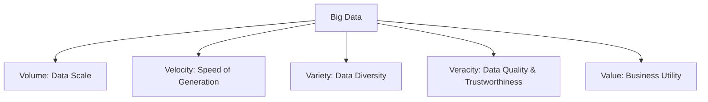

## 1. Introduction to Big Data

### What is Big Data?
**Big Data** refers to datasets whose size, complexity, and rate of generation make them difficult or impossible to capture, store, manage, process, or analyze using traditional relational database management systems (RDBMS) and desktop processing software.

In the modern digital landscape, data is generated continuously by social media platforms, IoT sensors, transactional databases, logs, GPS signals, and multimedia streams. The scale of this data requires a shift from centralized computing (single-server setups) to distributed storage and parallel processing frameworks.

### Types of Data
Data can be classified into three distinct categories based on its structure:

1. **Structured Data**
   * **Definition**: Data that conforms to a highly organized, predefined schema or tabular format. It is typically stored in rows and columns and can be queried easily using Structured Query Language (SQL).
   * **Characteristics**: Highly organized, easily searchable, fits neatly into databases.
   * **Examples**:
     * Relational Database (RDBMS) tables (e.g., customer profiles, transactional logs).
     * Spreadsheet files (Excel, CSV with strict schemas).
     * OLAP (Online Analytical Processing) cubes.

2. **Semi-Structured Data**
   * **Definition**: Data that does not reside in a rigid relational database table but contains internal markers (tags, keys, or metadata) that separate data elements and enforce hierarchies.
   * **Characteristics**: Flexible schema, self-describing, requires parsing to extract specific fields.
   * **Examples**:
     * **JSON (JavaScript Object Notation)**: Key-value structures widely used in APIs.
     * **XML (eXtensible Markup Language)**: Nested tags defining hierarchical attributes.
     * **YAML (YAML Ain't Markup Language)**: Configuration files.
     * NoSQL databases (e.g., MongoDB documents, Cassandra columns).

3. **Unstructured Data**
   * **Definition**: Data that has no predefined structure, schema, or organized model. It cannot be easily processed or queried using traditional relational methods.
   * **Characteristics**: Massive volume, raw, highly diverse formats, requires advanced processing (such as Natural Language Processing, Computer Vision, or text miners) to extract value.
   * **Examples**:
     * Multimedia files (images, audio files, videos).
     * Plain text documents (Word files, PDF reports, emails).
     * Server/system logs and raw text streams.
     * Social media posts, comments, and reviews.

---

### The 5 V's of Big Data
To understand the nature and challenges of Big Data, we analyze it through five primary dimensions:



1. **Volume**
   * **Concept**: The physical size or scale of the data being generated and stored. It is measured in Terabytes (TB), Petabytes (PB), or Exabytes (EB).
   * **Challenge**: Requires distributed storage architectures (like HDFS) that scale horizontally by adding commodity hardware rather than purchasing expensive high-end SANs/NASs.

2. **Velocity**
   * **Concept**: The speed at which new data is generated, collected, and processed. Data streams can be batch-processed, real-time, or near-real-time.
   * **Challenge**: Traditional databases fail under write-heavy, high-throughput loads. Fast processing systems (like Apache Spark Streaming or Kafka) are required to ingest and analyze data as it flows.

3. **Variety**
   * **Concept**: The structural diversity of the data sources. It represents the mixture of structured, semi-structured, and unstructured data types.
   * **Challenge**: Storing and processing varying data formats under a single system. Big Data systems must ingest files, logs, database records, and media streams without requiring a unified static schema.

4. **Veracity**
   * **Concept**: The quality, accuracy, and trustworthiness of the data. Raw data is often noisy, incomplete, or corrupted.
   * **Challenge**: Data cleaning, deduplication, and parsing are necessary before any valuable analysis can take place.

5. **Value**
   * **Concept**: The ultimate goal of collecting and processing Big Data. Storing data is costly; the data must be transformed into actionable insights that yield business intelligence, predictions, or optimizations.
   * **Challenge**: Aligning analytics pipelines with concrete business problems to extract actual value out of raw historical data.

---

## 2. Introduction to Apache Hadoop

### What is Apache Hadoop?
**Apache Hadoop** is an open-source, Java-based software framework designed for the distributed storage and parallel processing of massive datasets across clusters of commodity hardware. 

Hadoop was created by Doug Cutting and Mike Cafarella in 2005. It was inspired by Google's technical papers on the **Google File System (GFS)** (published in 2003) and **MapReduce** (published in 2004).

### Core Hadoop Philosophy: Data Locality
In traditional computing, data is transferred over the network from a storage server to a processing server. When working with petabytes of data, this network transfer becomes a major bottleneck. 
Hadoop flips this paradigm by implementing **Data Locality**:
* **Philosophy**: *"Move computation to the data, not data to the computation."*
* **Implementation**: The same physical nodes in a Hadoop cluster act as both storage nodes (DataNodes) and processing nodes (NodeManagers). Hadoop executes tasks directly on the machines that physically house the target data blocks, minimizing expensive network I/O.

### Core Components of Hadoop
The Hadoop ecosystem is built upon four foundational modules:

| Component | Description | Key Responsibility |
| :--- | :--- | :--- |
| **HDFS** (Hadoop Distributed File System) | The storage layer of Hadoop. | Handles distributed, fault-tolerant, horizontal storage of files. |
| **MapReduce** | The processing layer of Hadoop. | A programming model and execution engine for parallelized processing of data. |
| **YARN** (Yet Another Resource Negotiator) | The resource management layer. | Allocates system resources (RAM, CPU) and schedules processing jobs across the cluster. |
| **Hadoop Common** | The system library layer. | Contains utilities, Java libraries, and OS-level abstractions required by other Hadoop modules. |

---

## 3. Hadoop Architecture

Hadoop follows a **Master-Slave (or Leader-Follower) architecture** for both storage (HDFS) and processing (YARN).

```
                      +-------------------+
                      |    Client Node    |
                      +-------------------+
                                |
             +------------------+------------------+
             |                                     |
             v                                     v
  =====================                  =====================
  |  HDFS MASTER NODE |                  |  YARN MASTER NODE |
  |     NameNode      |                  |  ResourceManager  |
  =====================                  =====================
             |                                     |
    +--------+--------+                   +--------+--------+
    |                 |                   |                 |
    v                 v                   v                 v
=================  =================   =================  =================
| HDFS SLAVE    |  | HDFS SLAVE    |   | YARN SLAVE    |  | YARN SLAVE    |
| DataNode 1    |  | DataNode 2    |   | NodeManager 1 |  | NodeManager 2 |
=================  =================   =================  =================
| Physical Node 1                  |   | Physical Node 2                  |
+----------------------------------+   +----------------------------------+
```

### High Availability (HA) Architecture
In early versions of Hadoop (Hadoop 1.x), the NameNode was a Single Point of Failure (SPOF). If the NameNode crashed, the entire cluster became inaccessible. 

Modern Hadoop (Hadoop 2.x and 3.x) addresses this via **HDFS NameNode High Availability**:
* **Active NameNode**: Handles all client operations (reads, writes) and maintains active metadata updates.
* **Standby NameNode**: Keeps its memory in sync with the Active NameNode. If the Active NameNode fails, the Standby NameNode immediately assumes the Active role without downtime.
* **Shared Edit Log (JournalNodes)**: A quorum of JournalNodes is used by both NameNodes. The Active NameNode writes edits to the JournalNodes, and the Standby NameNode reads these edits to stay in sync.
* **ZooKeeper Failover Controller (ZKFC)**: Monitored by Apache ZooKeeper, ZKFC is a daemon that runs on both NameNode machines. It polls the NameNode health and automatically triggers failovers if the Active NameNode stops responding.

---

## 4. Hadoop Distributed File System (HDFS)

### HDFS Storage Concepts
HDFS is designed to store extremely large files (typically gigabytes to petabytes) reliably across a distributed environment. It is optimized for **streaming data access** under a **write-once, read-many-times (WORM)** pattern.

#### 1. Blocks
Files in HDFS are physically split into large, fixed-size chunks called **blocks**.
* **Default Block Size**: 128 MB (Hadoop 2.x/3.x) or 64 MB (Hadoop 1.x). (Traditional OS file systems use a block size of 4 KB).
* **Rationale**: 
  * Large blocks minimize the metadata overhead on the NameNode (since fewer block locations need to be indexed).
  * It reduces disk seek time; once the block is located on disk, streaming the large block is highly efficient.
* **Size Calculation**: If a file is 130 MB, HDFS splits it into two blocks: Block A (128 MB) and Block B (2 MB). Crucially, Block B only consumes 2 MB of physical disk space, not the full 128 MB block allocation.

#### 2. Replication Factor & Fault Tolerance
To guarantee durability against hardware failures, HDFS replicates each block across multiple physical machines.
* **Default Replication Factor**: 3 (each block is stored on 3 different DataNodes).
* **Rack Awareness Strategy**:
  1. The first replica is written to a local DataNode (if the write request is from inside the cluster) or a random DataNode.
  2. The second replica is written to a DataNode on a *different* remote rack.
  3. The third replica is written to a *different* DataNode on that *same* remote rack.
  * **Benefit**: Balances network write latency (writing to the same rack is fast) with catastrophe protection (if an entire rack loses power or networking, the data is still preserved on another rack).

---

### Detailed Read and Write Paths

#### Write Path in HDFS
```
Client                      NameNode                  DataNode 1 (DN1)        DataNode 2 (DN2)
  |                             |                            |                       |
  | 1. Create file request      |                            |                       |
  |---------------------------->|                            |                       |
  | 2. Verification & block list|                            |                       |
  |<----------------------------|                            |                       |
  |                             |                            |                       |
  | 3. Set up pipeline          |                            |                       |
  |--------------------------------------------------------->|                       |
  |                             |                            |                       |
  |                             | 4. Setup next stage        |                       |
  |                             |--------------------------->|                       |
  |                             |                            |                       |
  | 5. Stream data packets      |                            |                       |
  |--------------------------------------------------------->|                       |
  |                             |                            |                       |
  |                             | 6. Forward data packets    |                       |
  |                             |--------------------------->|                       |
  |                             |                            |                       |
  |                             |<---------------------------|                       |
  |                             |    7. ACK Packet Received  |                       |
  |<----------------------------|                            |                       |
  |    8. Final ACK             |                            |                       |
```

1. **Client Request**: The client sends a `create` request to the NameNode.
2. **NameNode Validation**: The NameNode checks if the file exists and if the client has permissions. It records the file path in the metadata and returns a list of target DataNodes where the first block should be written.
3. **Pipeline Setup**: The client contacts the first DataNode in the pipeline (DN1). DN1 connects to the second (DN2), which connects to the third (DN3) to establish a data streaming pipeline.
4. **Data Streaming**: The client buffers the block data into small packets (typically 64 KB) and streams them to DN1. 
5. **Data Replication**: As DN1 receives each packet, it writes it locally and immediately pipes it down to DN2, which writes locally and pipes it to DN3.
6. **Acknowledge Pipeline**: Once DN3 writes the packet, it sends an ACK back to DN2, which forwards it to DN1, and finally back to the client.
7. **Completion**: Once the entire block is streamed and all ACKs are received, the client closes the pipeline and notifies the NameNode that the block write is complete.

#### Read Path in HDFS
1. **Client Request**: The client calls `open()` on the distributed file system object.
2. **NameNode Lookup**: The client contacts the NameNode to get the block locations for the file. The NameNode returns the block IDs and a list of DataNodes holding replicas of each block, sorted by network proximity to the client.
3. **Direct Data Streaming**: The client contacts the closest DataNode containing the first block and reads the data via a stream.
4. **Sequential Traversal**: Once the block is read, the client closes the stream connection to that DataNode and opens a stream to the closest DataNode containing the next block.
5. **Fault Recovery**: If the DataNode fails or returns a corrupted block check, the client automatically falls back to the next closest DataNode holding that block replica and reports the dead node to the NameNode.

---

## 5. Hadoop Node Roles

### Master Nodes

#### 1. NameNode
The master daemon of HDFS. It manages the file system directory tree and metadata.
* **Metadata Structure**:
  * Names of directories, files, block mappings, file permissions, ownership, and replication details.
  * **Memory Residency**: For maximum performance, all HDFS metadata is loaded and maintained directly in the NameNode's RAM. (Approximate rule: 1 million HDFS blocks require ~1 GB of NameNode RAM).
* **Storage Files on Disk**:
  * **`fsimage` (File System Image)**: A complete serialization snapshot of the HDFS namespace up to a specific point in time. It is stored on the NameNode's local disk.
  * **`edits` (Edit Log)**: A transaction log that records every write, delete, append, or rename action performed on HDFS since the last `fsimage` snapshot.
* **Block Location Storage**: The NameNode does *not* write block physical locations permanently to `fsimage`. Instead, when the cluster boots, every DataNode sends a **Block Report** listing all its stored blocks. The NameNode constructs the active block map in memory dynamically from these reports.

#### 2. ResourceManager (YARN)
The master authority that manages cluster CPU and memory resources. It has two components:
* **Scheduler**: Allocates resources to running applications based on constraints (e.g., queues, capacities) without tracking application task status.
* **ApplicationsManager**: Accepts job submissions, negotiates the initial container for the ApplicationMaster, and restarts the ApplicationMaster on failure.

---

### Checkpointing: Secondary NameNode
The **Secondary NameNode** is *not* a backup or hot standby for the NameNode. Its primary job is to perform periodic **checkpoints** (merging `fsimage` and `edits` logs) to prevent the NameNode's Edit Log from growing indefinitely.

```
+------------------+                   +----------------------+
|     NameNode     |                   |  Secondary NameNode  |
+------------------+                   +----------------------+
        |                                         |
        | 1. Rollover active edit log             |
        |    (create new_edits)                   |
        |---------------------------------------->|
        |                                         |
        | 2. Fetch fsimage & old edit log         |
        |    via HTTP                             |
        |<----------------------------------------|
        |                                         |
        |                                         | 3. Read fsimage and edits,
        |                                         |    merge them to create
        |                                         |    new fsimage.ckpt
        |                                         |
        | 4. Push new fsimage.ckpt                |
        |    via HTTP                             |
        |<----------------------------------------|
        |                                         |
        | 5. Replace old fsimage with new one     |
        |    and merge new_edits into active log  |
        v                                         v
```

#### Detailed Checkpoint Process:
1. **Trigger**: Every 1 hour (by default) or when the edit log reaches a threshold size (default 64MB), the checkpoint process begins.
2. **Rollover Log**: The NameNode rolls over its active `edits` log. New writes are written to a new file named `edits_inprogress`.
3. **Fetch Logs**: The Secondary NameNode fetches the older `fsimage` and the rolled-over `edits` file from the NameNode via HTTP.
4. **Merge**: The Secondary NameNode loads both files into its own RAM, plays the edit log changes over the `fsimage`, and compiles a new merged image file (`fsimage.ckpt`).
5. **Upload**: The Secondary NameNode uploads the new `fsimage.ckpt` back to the NameNode.
6. **Replace**: The NameNode replaces the old `fsimage` on disk with the new one and updates the active configuration.

---

### Slave Nodes

#### 1. DataNode
Runs on the worker nodes of the cluster. It stores and retrieves raw blocks of data when requested by clients or the NameNode.
* **Heartbeats**: DataNodes send heartbeats to the NameNode every 3 seconds (default). If a DataNode does not send a heartbeat for 10 minutes, the NameNode declares it dead and schedules replication of its blocks onto other healthy DataNodes.
* **Block Reports**: Every 6 hours (default), DataNodes send a list of all locally stored blocks to help the NameNode reconstruct block mappings.

#### 2. NodeManager (YARN)
Runs on each worker node. It monitors container resource usage (CPU, memory) and reports node health statistics back to the ResourceManager.

---

### Legacy Daemons (Hadoop 1.x)
In Hadoop 1.x, resource management and processing were coupled inside two components:
* **JobTracker (Master)**: Managed cluster resources and coordinated MapReduce job execution. It allocated tasks (Map or Reduce) to TaskTrackers, monitored progress, and re-scheduled failed tasks.
* **TaskTracker (Slave)**: Ran on worker nodes. It executed the Map and Reduce tasks assigned by the JobTracker and sent heartbeats to report task progress.
* *Note*: These were replaced by **YARN** (ResourceManager & NodeManagers) in Hadoop 2.x to enable support for non-MapReduce processing engines (like Spark and Flink) on the same cluster.

---

## 6. HDFS Command-Line Interface (CLI)

Below is an exhaustive reference table of all standard HDFS file system management commands. All commands use the `hdfs dfs` or `hadoop fs` prefix.

| Command Syntax | Description | Example Usage |
| :--- | :--- | :--- |
| `hadoop fs -ls <path>` | Lists the contents of a directory. | `hadoop fs -ls /user/hadoop/input` |
| `hadoop fs -mkdir [-p] <path>` | Creates a directory. `-p` creates parent folders. | `hadoop fs -mkdir -p /data/raw` |
| `hadoop fs -put <local_src> <hdfs_dst>` | Copies files from the local OS disk to HDFS. | `hadoop fs -put local_data.csv /data/raw/` |
| `hadoop fs -copyFromLocal <local_src> <hdfs_dst>` | Identical to `-put`. | `hadoop fs -copyFromLocal notes.txt /user/` |
| `hadoop fs -get <hdfs_src> <local_dst>` | Copies files from HDFS back to the local OS disk. | `hadoop fs -get /data/raw/data.csv ./local_dir/` |
| `hadoop fs -copyToLocal <hdfs_src> <local_dst>` | Identical to `-get`. | `hadoop fs -copyToLocal /user/notes.txt ./` |
| `hadoop fs -cat <path>` | Prints file contents directly to stdout. | `hadoop fs -cat /user/logs.txt` |
| `hadoop fs -text <path>` | Prints file contents, decoding compressed formats. | `hadoop fs -text /user/logs.txt.gz` |
| `hadoop fs -rm [-r] [-skipTrash] <path>` | Deletes files/directories. `-r` is recursive. | `hadoop fs -rm -r /data/raw` |
| `hadoop fs -mv <src> <dst>` | Moves/renames files inside HDFS. | `hadoop fs -mv /data/old.txt /data/new.txt` |
| `hadoop fs -cp <src> <dst>` | Copies files within HDFS. | `hadoop fs -cp /data/raw/f1.txt /data/backup/` |
| `hadoop fs -du -h <path>` | Shows size of files/directories. `-h` is human-readable. | `hadoop fs -du -h /data` |
| `hadoop fs -chmod <mode> <path>` | Changes file permissions. | `hadoop fs -chmod 755 /data/raw/file.txt` |
| `hadoop fs -chown <owner>:<group> <path>` | Changes owner and group settings. | `hadoop fs -chown hduser:hadoop /data` |
| `hadoop fs -tail <path>` | Displays the last kilobyte of a file to stdout. | `hadoop fs -tail /user/application.log` |
| `hdfs dfsadmin -report` | Administrative report showing cluster storage stats. | `hdfs dfsadmin -report` |

---

## 7. Word Count Execution Walkthrough on HDFS CLI

To test a functional Hadoop cluster deployment, you run a **Word Count MapReduce job** using the pre-compiled examples library shipped with Hadoop installations.

### Step 1: Create a Local Test Input File
Create a text file containing some random paragraphs on your local machine.
```bash
echo "Hadoop is an open source framework for distributed storage." > input.txt
echo "Hadoop storage layer is called HDFS." >> input.txt
echo "Hadoop processing engine is called MapReduce." >> input.txt
echo "Hadoop resource negotiator is YARN." >> input.txt
```

### Step 2: Create target HDFS Directories
Create an input directory inside the HDFS file system to hold the source text files.
```bash
hadoop fs -mkdir -p /wordcount/input
```

### Step 3: Upload the Input File to HDFS
Upload your local `input.txt` file to the directory you just created in HDFS.
```bash
hadoop fs -put input.txt /wordcount/input/
```
Verify the file was successfully uploaded:
```bash
hadoop fs -ls /wordcount/input/
```

### Step 4: Run the MapReduce WordCount Jar
Locate the Hadoop examples jar inside your Hadoop home folder (usually in `/share/hadoop/mapreduce/` or `/usr/local/hadoop/share/hadoop/mapreduce/`) and run the application.

```bash
# General Syntax: hadoop jar <path_to_jar> wordcount <hdfs_input_dir> <hdfs_output_dir>
hadoop jar /usr/local/hadoop/share/hadoop/mapreduce/hadoop-mapreduce-examples-*.jar wordcount /wordcount/input /wordcount/output
```
> [!WARNING]
> The target HDFS output directory (`/wordcount/output` in this case) **must not exist** before running the command. If it exists, the MapReduce driver will fail with an `AlreadyExistsException` to prevent accidental data overwriting.

### Step 5: Check Execution Output
Upon successful execution, the MapReduce engine generates two files inside the target HDFS output directory:
- `_SUCCESS`: An empty metadata file indicating the job completed without errors.
- `part-r-00000`: A text file containing the sorted key-value output (word counts).

List the output directory contents:
```bash
hadoop fs -ls /wordcount/output
```

Read the output counts file directly:
```bash
hadoop fs -cat /wordcount/output/part-r-00000
```

**Expected Output Structure:**
```text
HDFS.       1
Hadoop      4
Hadoop.     1
MapReduce.  1
YARN.       1
an          1
called      2
distributed 1
engine      1
for         1
framework   1
is          3
layer       1
negotiator  1
open        1
processing  1
resource    1
source      1
storage     1
storage.    1
```
