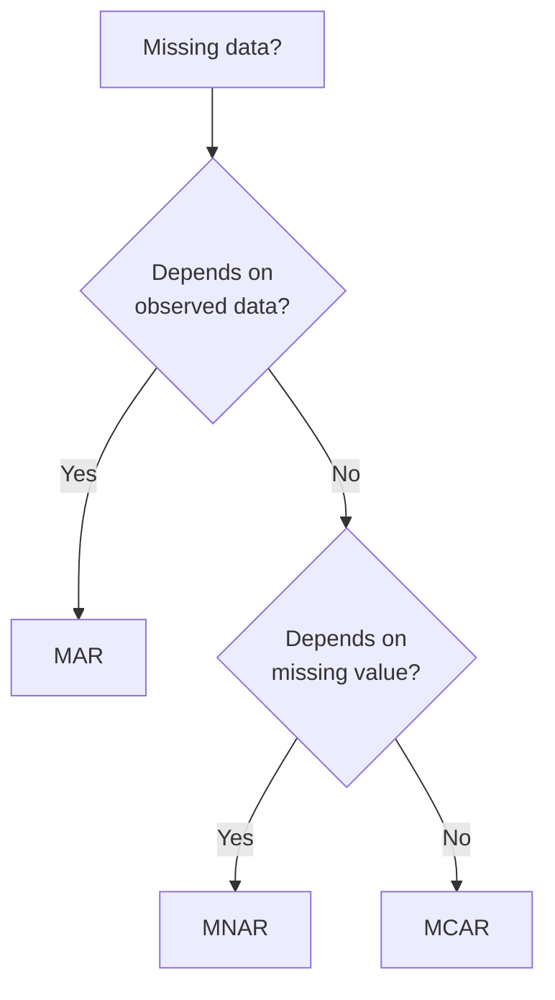

[[The Machine Learning Workflow#^8f81f7|<- Back to Workflow]] 

## 1. Collection & Assembly

>**Collection**: Data is the foundation of any ML model. Systematic data collection ensures your model learns a diverse and representative set of real-world patterns.
>**Assembly**: Instead of relying on a single algorithm, you can assemble multiple models to form a robust, powerful predictor.
> This is the process of gathering raw data from various sources: logs, APIs, sensors, databases, human annotation.
## Overview

The first step in any data pipeline: **gathering raw data** from diverse sources such as logs, APIs, sensors, databases, and human annotation. This stage lays the foundation for all downstream processing, analysis, and modeling.

> **Key balance**: What you actively do vs. common pitfalls that can destroy data quality before you even start.

---

## What You Do – Actions & Best Practices

### 1. Identify Data Sources
- **Logs** – Server, application, or system logs (e.g., web server access logs, error logs).
- **APIs** – REST, GraphQL, streaming APIs (Twitter, weather, financial data).
- **Sensors** – IoT devices, hardware monitors, environmental sensors.
- **Databases** – SQL, NoSQL, time-series DBs (direct extraction via queries).
- **Human Annotation** – Manual labeling, surveys, expert judgments.

### 2. Define Collection Strategy
- **Batch vs. Stream** – Decide on periodic batch dumps (e.g., hourly, daily) or real‑time ingestion.
- **Time Window** – Specify the period of interest (e.g., last 7 days, last month, specific event window).
- **Sampling** – If data volume is huge, use random or stratified sampling (but document it).

### 3. Implement Collection Mechanisms
- **For logs**: Use `tail`, `grep`, or log shippers (Fluentd, Logstash).
- **For APIs**: Write scripts with `requests` (Python) or `curl`, handle rate limits and pagination.
- **For sensors**: Set up MQTT brokers, edge gateways, or direct serial reads.
- **For databases**: Use `SELECT` queries with filters; avoid `SELECT *` on huge tables.
- **For human annotation**: Design clear forms (e.g., LabelStudio, Spreadsheets), include inter‑annotator agreement checks.

### 4. Assemble & Store Raw Data
- Store in a **raw zone** (data lake or separate folder) – never modify original files.
- Use **immutable file naming** (e.g., `source_YYYYMMDD_HHMMSS.parquet`).
- Keep a **manifest** or **catalog** (which files belong to which time window, source version).

### 5. Log Metadata
Record for each collection run:
- Start & end time of collection
- Source system version/endpoint
- Number of records retrieved
- Any errors or retries

---

## Common Pitfalls – Detailed Explanation

### 🔴 Pitfall 1: Using the Wrong Time Window

**What does it mean?**  
Selecting a time range that does not match the analysis objective or introduces systematic bias.

**Examples:**
- Analyzing user behavior but collecting data only during business hours (ignoring night/weekend patterns).
- Comparing sales across months but using different length windows (e.g., 30 days vs. 28 days) without adjustment.
- Collecting data from 00:00 UTC when local time zone of events is UTC+5 – creates misaligned daily aggregates.

**Consequences:**
- Invalid comparisons (apples to oranges).
- Missing seasonality or periodic effects.
- Leakage between training and test splits if time boundaries are not respected.

**How to avoid:**
- **Explicitly define** the intended time window in a data specification document.
- Use **time‑zone aware** timestamps (UTC + offset).
- **Validate** that collection start/end times align with the natural cycles of your domain (e.g., fiscal month, week start day).
- Add automated checks: number of records per time unit should be roughly stable unless expected.

---

### 🟠 Pitfall 2: Data Missing at Random (MAR) vs. Not at Random (MNAR)

**What does it mean?**  
Missing data is not just an annoyance – its **mechanism** determines whether you can fix it with simple imputation or must treat it as a source of bias.

| Mechanism | Definition | Example |
|-----------|------------|---------|
| **MCAR** (Missing Completely at Random) | Missingness has no relationship to any variable. | Sensor randomly fails 1% of the time due to cosmic ray. |
| **MAR** (Missing at Random) | Missingness depends on observed variables, not on the missing value itself. | Men are less likely to fill in income question, but missingness does **not** depend on their actual income. |
| **MNAR** (Missing Not at Random) | Missingness depends on the unobserved (missing) value itself. | People with very high income deliberately skip the income field. |

**Why this distinction matters:**
- **MAR** can be handled by **imputation** using other variables (e.g., regression, MICE) – the missing data mechanism is ignorable.
- **MNAR** cannot be fixed by standard imputation – you need **model‑based** approaches (Heckman correction, selection models) or you must **collect additional data** to understand why values are missing.

**Common mistake:**
Treating all missing data as MAR and blindly using mean/median imputation. This can hide severe bias (e.g., your imputed average income becomes much lower than reality).

**How to detect and handle:**

1. **Visualize** missing patterns – a `missingno` matrix can reveal systematic gaps.
2. **Test for MNAR** – create a “missing” indicator and see if it correlates with other variables (if no correlation, likely MCAR; if correlation with observed variables, MAR; if unexplained, suspect MNAR).
3. **Collect auxiliary information** – e.g., add a survey question “why did you skip this field?” or log sensor health metrics alongside measurements.
4. **Use sensitivity analysis** – impute under different assumptions (best‑case, worst‑case) to bound the bias.

> **Pro tip**: Always **document the missingness mechanism assumption** in your data pipeline. If you later find MNAR, redesign collection (e.g., add fallback sensors, enforce mandatory fields with “prefer not to say” option).

---

## Example Workflow (Checklist)

- [ ] Define **time window** (including time zone)
- [ ] List all sources with collection method (API, log, etc.)
- [ ] Implement collection script with:
  - [ ] Pagination / rate limiting
  - [ ] Error handling & retries
  - [ ] Timestamp recording for each record
- [ ] Store raw data in immutable folder
- [ ] Compute summary stats (row count per hour/day)
- [ ] Check for **wrong time window**:
  - [ ] Plot record counts over time – any sudden drops or missing periods?
- [ ] Assess **missing data**:
  - [ ] Generate missingness matrix
  - [ ] Distinguish between MCAR / MAR / MNAR
  - [ ] Decide handling strategy (imputation, flagging, or re‑collection)
- [ ] Log all decisions as a Data Collection Note (link here)