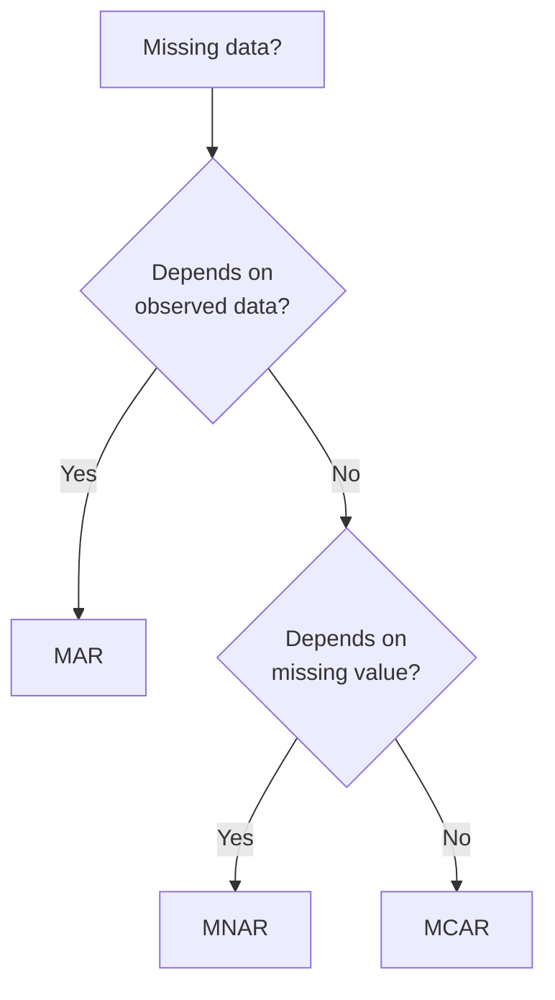
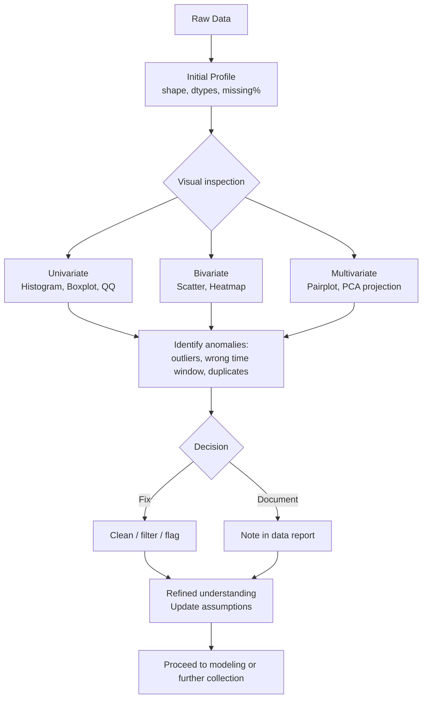
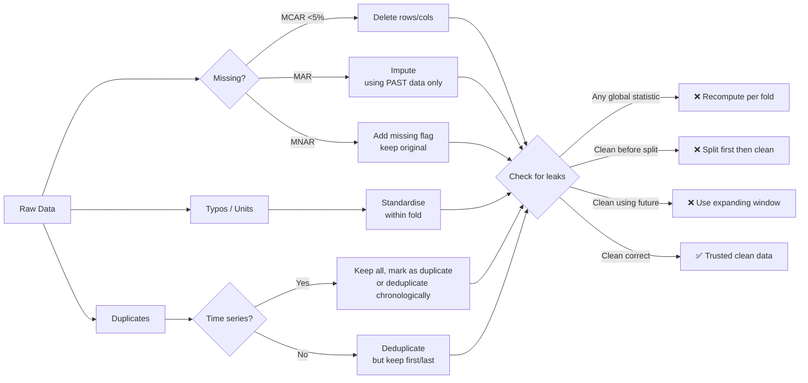
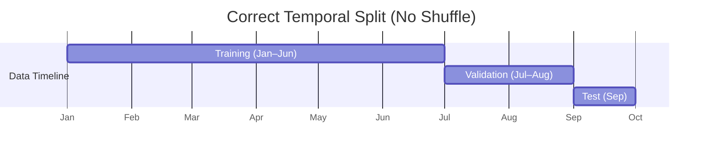
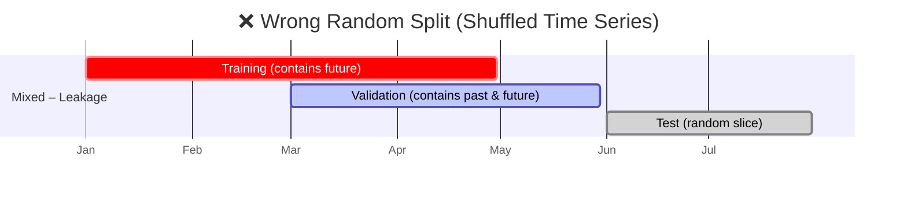

 [[The Machine Learning Workflow|<- Back to Workflow]] 
## 1. Collection & Assembly

>**Collection**: Data is the foundation of any ML model. Systematic data collection ensures your model learns a diverse and representative set of real-world patterns.
>**Assembly**: Instead of relying on a single algorithm, you can assemble multiple models to form a robust, powerful predictor.
> This is the process of gathering raw data from various sources: logs, APIs, sensors, databases, human annotation.
## Overview

The first step in any data pipeline: **gathering raw data** from diverse sources such as logs, APIs, sensors, databases, and human annotation. This stage lays the foundation for all downstream processing, analysis, and modeling.

> **Key balance**: What you actively do vs. common pitfalls that can destroy data quality before you even start.

---

## What You Do – Actions & Best Practices

### 1. Identify Data Sources
- **Logs** – Server, application, or system logs (e.g., web server access logs, error logs).
- **APIs** – REST, GraphQL, streaming APIs (Twitter, weather, financial data).
- **Sensors** – IoT devices, hardware monitors, environmental sensors.
- **Databases** – SQL, NoSQL, time-series DBs (direct extraction via queries).
- **Human Annotation** – Manual labeling, surveys, expert judgments.

### 2. Define Collection Strategy
- **Batch vs. Stream** – Decide on periodic batch dumps (e.g., hourly, daily) or real‑time ingestion.
- **Time Window** – Specify the period of interest (e.g., last 7 days, last month, specific event window).
- **Sampling** – If data volume is huge, use random or stratified sampling (but document it).

### 3. Implement Collection Mechanisms
- **For logs**: Use `tail`, `grep`, or log shippers (Fluentd, Logstash).
- **For APIs**: Write scripts with `requests` (Python) or `curl`, handle rate limits and pagination.
- **For sensors**: Set up MQTT brokers, edge gateways, or direct serial reads.
- **For databases**: Use `SELECT` queries with filters; avoid `SELECT *` on huge tables.
- **For human annotation**: Design clear forms (e.g., LabelStudio, Spreadsheets), include inter‑annotator agreement checks.

### 4. Assemble & Store Raw Data
- Store in a **raw zone** (data lake or separate folder) – never modify original files.
- Use **immutable file naming** (e.g., `source_YYYYMMDD_HHMMSS.parquet`).
- Keep a **manifest** or **catalog** (which files belong to which time window, source version).

### 5. Log Metadata
Record for each collection run:
- Start & end time of collection
- Source system version/endpoint
- Number of records retrieved
- Any errors or retries

---

## Common Pitfalls – Detailed Explanation

### 🔴 Pitfall 1: Using the Wrong Time Window

**What does it mean?**  
Selecting a time range that does not match the analysis objective or introduces systematic bias.

**Examples:**
- Analyzing user behavior but collecting data only during business hours (ignoring night/weekend patterns).
- Comparing sales across months but using different length windows (e.g., 30 days vs. 28 days) without adjustment.
- Collecting data from 00:00 UTC when local time zone of events is UTC+5 – creates misaligned daily aggregates.

**Consequences:**
- Invalid comparisons (apples to oranges).
- Missing seasonality or periodic effects.
- Leakage between training and test splits if time boundaries are not respected.

**How to avoid:**
- **Explicitly define** the intended time window in a data specification document.
- Use **time‑zone aware** timestamps (UTC + offset).
- **Validate** that collection start/end times align with the natural cycles of your domain (e.g., fiscal month, week start day).
- Add automated checks: number of records per time unit should be roughly stable unless expected.

---

### 🟠 Pitfall 2: Data Missing at Random (MAR) vs. Not at Random (MNAR)

**What does it mean?**  
Missing data is not just an annoyance – its **mechanism** determines whether you can fix it with simple imputation or must treat it as a source of bias.

| Mechanism | Definition | Example |
|-----------|------------|---------|
| **MCAR** (Missing Completely at Random) | Missingness has no relationship to any variable. | Sensor randomly fails 1% of the time due to cosmic ray. |
| **MAR** (Missing at Random) | Missingness depends on observed variables, not on the missing value itself. | Men are less likely to fill in income question, but missingness does **not** depend on their actual income. |
| **MNAR** (Missing Not at Random) | Missingness depends on the unobserved (missing) value itself. | People with very high income deliberately skip the income field. |

**Why this distinction matters:**
- **MAR** can be handled by **imputation** using other variables (e.g., regression, MICE) – the missing data mechanism is ignorable.
- **MNAR** cannot be fixed by standard imputation – you need **model‑based** approaches (Heckman correction, selection models) or you must **collect additional data** to understand why values are missing.

**Common mistake:**
Treating all missing data as MAR and blindly using mean/median imputation. This can hide severe bias (e.g., your imputed average income becomes much lower than reality).

**How to detect and handle:**

1. **Visualize** missing patterns – a `missingno` matrix can reveal systematic gaps.
2. **Test for MNAR** – create a “missing” indicator and see if it correlates with other variables (if no correlation, likely MCAR; if correlation with observed variables, MAR; if unexplained, suspect MNAR).
3. **Collect auxiliary information** – e.g., add a survey question “why did you skip this field?” or log sensor health metrics alongside measurements.
4. **Use sensitivity analysis** – impute under different assumptions (best‑case, worst‑case) to bound the bias.

> **Pro tip**: Always **document the missingness mechanism assumption** in your data pipeline. If you later find MNAR, redesign collection (e.g., add fallback sensors, enforce mandatory fields with “prefer not to say” option).

---

## Example Workflow (Checklist)

- [ ] Define **time window** (including time zone)
- [ ] List all sources with collection method (API, log, etc.)
- [ ] Implement collection script with:
  - [ ] Pagination / rate limiting
  - [ ] Error handling & retries
  - [ ] Timestamp recording for each record
- [ ] Store raw data in immutable folder
- [ ] Compute summary stats (row count per hour/day)
- [ ] Check for **wrong time window**:
  - [ ] Plot record counts over time – any sudden drops or missing periods?
- [ ] Assess **missing data**:
  - [ ] Generate missingness matrix
  - [ ] Distinguish between MCAR / MAR / MNAR
  - [ ] Decide handling strategy (imputation, flagging, or re‑collection)
- [ ] Log all decisions as a Data Collection Note (link here)

[[The Machine Learning Workflow#🧩 Sub‑stages of “Data” (the detailed path)|<- Back to Table]] 

---
---
## 2. Exploratory Data Analysis (EDA)

EDA is the **visual and quantitative detective work** you perform on raw data before formal modeling. It reveals the structure, anomalies, patterns, and assumptions you need to make – or break. The goal is **not** to produce polished results, but to understand what you actually have.
## Overview

> **Key balance**: What you actively do (profiling, plotting, testing) vs. the dangerous shortcut of trusting summary statistics without looking at the data.

---

## What You Do – Core EDA Actions

### 1. Profile Distributions
- **For numeric variables**: Compute mean, median, mode, variance, skewness, kurtosis.  
- **For categorical**: Frequency tables, mode, number of unique levels.  
- **For time series**: Plot value over time, detect trends/seasonality.

### 2. Assess Correlations
- **Pairwise correlations** (Pearson for linear, Spearman for monotonic).  
- **Correlation matrix** heatmap to spot multicollinearity.  
- For categorical vs. numeric: ANOVA or point‑biserial correlation.

### 3. Quantify Missingness
- **Per‑column missing percentage**.  
- **Missing pattern matrix** – which columns tend to be missing together?  
- Use `missingno` (Python) or `visdat` (R) to visualise gaps.

### 4. Detect Outliers
- **Univariate methods**: IQR (interquartile range), Z‑score, modified Z‑score.  
- **Multivariate methods**: Mahalanobis distance, isolation forests.  
- Always **contextualise**: an outlier might be a rare event or an error.

### 5. Identify Duplicates
- **Exact duplicates** (all columns equal).  
- **Near‑duplicates** (fuzzy matching on text, timestamps within seconds).  
- **Domain‑specific duplicates** (e.g., same customer ID with different names).

### 6. Visualise Everything (Don’t skip!)
- **Histograms / KDE plots** – shape (normal, bimodal, long‑tailed).  
- **Boxplots** – outliers and spread per category.  
- **Scatter plots** – relationships, clusters, heteroscedasticity.  
- **Pair plots** (e.g., `seaborn.pairplot`) for a quick multivariate scan.  
- **QQ plots** – check normality assumption if needed.

---
## Common Pitfall – Skipping Visual Checks & Trusting Summary Stats Blindly

### Why this is dangerous

Summary statistics (mean, std, correlation coefficient) **hide** critical patterns. They are **reductive** – a single number cannot represent the full distribution.

### Classic examples (Anscombe’s quartet & beyond)

| Dataset | Mean X | Mean Y | Variance X | Correlation | *But the scatter plots look completely different* |
|---------|--------|--------|------------|-------------|-----------------------------------------------------|

- Linear relationship with no outliers
- Curvilinear relationship (correlation near zero)
- One extreme outlier driving the correlation
- Vertical line (X constant except one point)

If you **only** look at correlation = 0.82, you miss that the data is a parabola, or a single outlier, or two separate clusters.

### Additional traps

1. **Mode / median hiding multimodality** – Two peaks produce the same mean as one peak.  
2. **Boxplots without raw data** – Two very different distributions (e.g., uniform vs. bimodal) can have identical boxplot statistics.  
3. **Missingness ignored** – Summary stats often computed after dropping missing values → you never see *why* they are missing.  
4. **Outliers masked** – A few extreme points can shift the mean, but the median stays “normal”. Trusting median without plotting hides the existence of those extremes.

### Real‑world consequence

You build a regression model, validate on summary stats, and deploy.  
In production, the model fails because the unseen bimodal pattern (e.g., day vs. night behavior) was never accounted for – you only saw the average.

### How to avoid – mandatory visual checks

For **every** numeric column, produce at least:
- Histogram or KDE
- Boxplot
- If time series: line plot

For **every** pair of important columns:
- Scatter plot (or hexbin for large N)

Use automated **visual EDA frameworks**:
- `pandas-profiling` / `ydata-profiling` – generates a full HTML report with distributions, correlations, missingness, and alert for problematic patterns.
- `sweetviz` – compares two datasets (e.g., train vs. test).
- `D-Tale` – interactive GUI.

> **Rule of thumb**: If you don't look at each variable’s distribution with your own eyes, you haven't done EDA.

---

## Graphical Workflow – EDA Process (Mermaid)

___
## Obsidian Checklist for EDA

- [ ] **Load data** into a notebook (Jupyter, RMarkdown, etc.)
- [ ] **Initial summary** – `df.info()`, `df.describe(include='all')`
- [ ] **Missingness report**:
  - [ ] Table of missing % per column
  - [ ] Visual matrix (missingno)
- [ ] **Distribution checks** (every numeric column):
  - [ ] Histogram + KDE
  - [ ] Boxplot (with outliers highlighted)
  - [ ] QQ plot (if normality relevant)
- [ ] **Correlation check**:
  - [ ] Heatmap of Pearson / Spearman
  - [ ] Scatter matrix for highly correlated pairs (>0.7 or <-0.7)
- [ ] **Outlier investigation**:
  - [ ] IQR method – list potential outliers
  - [ ] Domain check: are they real or errors?
- [ ] **Duplicate detection**:
  - [ ] Exact duplicates – count and review
  - [ ] Near‑duplicates – fuzzy matching (if text or time)
- [ ] **Visual sanity**:
  - [ ] Generate an **automated profile report** (pandas-profiling)
  - [ ] Review **all plots** – no blind trust in numbers
- [ ] **Write EDA summary note** (link here) including:
  - [ ] Surprising patterns found
  - [ ] Actions taken (filter, impute, flag)
  - [ ] Remaining open questions

[[The Machine Learning Workflow#🧩 Sub‑stages of “Data” (the detailed path)|<- Back to Table]] 

___
___
## 3. Data Cleaning

Cleaning transforms raw, messy data into a reliable, analysis‑ready state. You’ll handle missing values, fix typos, remove duplicates, and standardise units. The goal is **not** to make data perfect, but to make it **trustworthy** for downstream tasks.
## Overview

> **Key balance**: What you actively do vs. two lethal pitfalls – deleting too much (losing signal) and introducing future information (leaking time).

---

## What You Do – Core Cleaning Actions

### 1. Handle Missing Values

| Approach | When to use | How to do |
|----------|-------------|-----------|
| **Delete** | Missingness is MCAR and <5% of rows/column | `df.dropna()` |
| **Impute** | MAR, small % missing | Mean/median for numeric, mode for categorical; regression or KNN for complex |
| **Flag**   | MNAR or missingness itself is informative | Create `col_missing` indicator (0/1) |

### 2. Correct Typos & Inconsistencies
- **String standardisation**: lowercasing, trimming spaces, fixing abbreviations (e.g., "NY" vs "New York").
- **Domain validation**: Check values against allowed list (e.g., gender: M/F/X).
- **Fuzzy matching** for near‑identical labels (e.g., "Apple inc." vs "Apple Inc.").

### 3. Remove Duplicates
- **Exact duplicates**: Keep first or last occurrence, or aggregate.
- **Near‑duplicates**: Define a similarity threshold (e.g., Levenshtein ratio >0.9) and merge or flag.

### 4. Fix Inconsistent Units
- Convert all measurements to a **single unit system** (e.g., all lengths to meters, all currencies to USD with timestamped exchange rates).
- Use explicit conversion tables – never guess.

### 5. Validate Data Types
- Parse dates with timezone info.
- Convert integers stored as strings.
- Ensure categoricals are `category` dtype for efficiency.

---

## Common Pitfalls

### 🔴 Pitfall 1: Deleting Too Much

**What does it mean?**  
Aggressively removing rows or columns with missing values, duplicates, or outliers, thereby losing valuable signal or introducing bias.

**Examples:**
- Dropping all rows with any missing value (listwise deletion) when missingness is **not MCAR** – you end up with a non‑representative sample.
- Deleting duplicate rows without checking if they are valid repeated measurements (e.g., sensor records same temperature twice – both are real).
- Removing outliers that are actually rare but real events (e.g., fraud transactions, high‑value purchases).

**Consequences:**
- Reduced statistical power.
- Biased estimates (e.g., if high‑income people are more likely to skip the income field, deleting those rows removes high earners from analysis).
- Training a model on a “too clean” dataset that fails in production because real‑world data has those variations.

**How to avoid:**
- **Always document** deletion count and reason.
- **Compare distributions** before and after deletion – if they change significantly, reconsider.
- Use **indicator flags** instead of deletion (keep the row, but mark `missing_income = 1`).
- For duplicates: decide whether they represent true duplicates (error) or repeated events – keep if the latter.

> **Rule**: When in doubt, **impute or flag** – do not delete. Deletion should be your last resort.

---

### 🔴 Pitfall 2: Introducing Future Information (Data Leakage)

**What does it mean?**  
Using information that would **not be available** at prediction time to clean or transform the data. This creates overly optimistic results and fails in production.

**Examples in cleaning:**

| Action | Leakage type |
|--------|---------------|
| Imputing missing values using the **global mean** of the entire dataset, then splitting train/test | Test set mean influences training |
| Removing outliers based on percentiles computed from **all data** (including future) | Same leakage |
| Using **future values** to fill missing time series (e.g., forward‑filling from tomorrow) | Future information |
| Deduplicating using a timestamp column – if you drop the later duplicate, you used the fact that a future event existed | Temporal leakage |

**Consequences:**
- Model appears to have 99% accuracy in validation, but achieves 50% in production.
- Time‑series forecasts become impossible because the cleaned training set contains “knowledge” of the future.

**How to avoid – always respect time:**

1. **Split before cleaning** – If you have a temporal task (forecasting, time‑series CV), split data into train / validation / test **chronologically** first, then clean each fold separately using **only information from the past**.
2. **Use rolling statistics** – For imputation or outlier detection, use expanding window or rolling window (e.g., impute missing value at day `t` using mean of days `1…t-1`).
3. **Check your pipeline** – Ensure no `fit` on full data before `split`. Use `Pipeline` with `TimeSeriesSplit` in `sklearn`.
4. **Flag future leaks** – If you ever compute a statistic (mean, median, threshold) from the entire dataset, you’ve leaked.

> **Golden rule**: Any transformation that depends on the whole dataset is dangerous. Make it **per‑fold** or **expanding window**.

---

## Mermaid Diagram – Cleaning Workflow with Pitfall Guards

---
## Obsidian Checklist for Cleaning

- [ ] **Before cleaning**: Split data if temporal (train/val/test chronologically)
- [ ] **Missing values**:
  - [ ] Classify mechanism (MCAR / MAR / MNAR)
  - [ ] If MCAR and <5% → drop
  - [ ] If MAR → impute using **past only** (expanding mean, KNN from train)
  - [ ] If MNAR → create indicator column, keep missing as special value
- [ ] **Typos & units**:
  - [ ] Standardise strings (lower, strip, mapping table)
  - [ ] Convert units to one system (document conversion factors)
- [ ] **Duplicates**:
  - [ ] Check if duplicates are errors or real repeats
  - [ ] If real, keep all (maybe add duplicate flag)
  - [ ] If errors, deduplicate but respect time order
- [ ] **Outliers** (often done in cleaning):
  - [ ] Detect with IQR / domain rules
  - [ ] **Do not delete** – cap, flag, or treat as separate category
- [ ] **Leakage audit**:
  - [ ] Confirm no `mean`, `median`, `percentile` computed on entire dataset
  - [ ] Confirm no future timestamps used in imputation
  - [ ] Run a “dry run” with temporal CV – does cleaning repeat correctly?
- [ ] **Document every change** – link to cleaning log

[[The Machine Learning Workflow#🧩 Sub‑stages of “Data” (the detailed path)|<- Back to Table]] 

---
---

## 4. Data Splitting (Train / Validation / Test)

The core principle: **the test set must never influence any decision** – not directly, not indirectly through validation.
## Overview

Splitting partitions your cleaned data into three independent sets:
- **Train** (≈70%) – model learning.
- **Validation** (≈15%) – hyperparameter tuning, model selection.
- **Test** (≈15%) – final, one‑time evaluation of generalization.

> **Key balance**: What you actively do vs. two deadly sins – random splitting when data has time or group structure, and leakage from validation into training.

---

## What You Do – Splitting Strategies

### 1. Random Splitting (Default)
- Shuffle data, then assign to train/val/test.
- Works when **rows are independent and identically distributed (i.i.d.)** – no time order, no groups.

### 2. Temporal Splitting (For Time Series)
- **Chronological order must be preserved** – never shuffle.
- Typical split: train = older dates, val = middle dates, test = most recent dates.
- Example: Train: Jan–Jun, Val: Jul–Aug, Test: Sep.

### 3. Group‑Based Splitting
- Keep all rows belonging to the same entity (customer, patient, sensor) in **one split only**.
- Otherwise, same entity appears in both train and test → leakage.
- Use `GroupKFold` or `LeaveOneGroupOut`.

### 4. Stratified Splitting
- Preserve class proportions (for classification) across splits.
- Use `stratify` parameter in `train_test_split`.

### 5. Nested Splitting for Model Selection
- Outer loop: train/test.
- Inner loop: train/val (often with cross‑validation).

---

## Common Pitfalls

### 🔴 Pitfall 1: Random Split When Data Is Time‑Series

**What does it mean?**  
Shuffling time‑dependent data before splitting. Future events end up in training, past events in test – completely reversing causality.

**Example:**
- Stock prices: training on tomorrow’s price to predict today.
- Weather: training on summer data, testing on winter data but shuffled so summer appears in test and winter in train – model learns wrong seasonal patterns.

**Consequences:**
- Artificially high performance (model sees the future during training).
- Production failure: real‑world forecasting uses only the past, but your training had the future.

**How to avoid:**
- **Never shuffle** if time order matters.
- Use `TimeSeriesSplit` from sklearn or manually split by date.
- Add a **time cutoff** – all train dates < all val dates < all test dates.

---

### 🟠 Pitfall 2: Data Leakage from Validation into Training

**What does it mean?**  
Using validation set statistics (mean, thresholds, feature selection) to adjust training, without proper nesting. Or using early stopping on validation but then retraining on train+val before final test.

**Examples:**
- Normalising features using mean/std computed from **train+val**, then splitting – validation influences training.
- Selecting best model based on validation accuracy, then retraining that model on **train+val** and reporting test score – test is now contaminated by validation decisions.
- Doing feature selection on full data, then splitting – validation features influence training.

**Consequences:**
- Optimistic bias – test score no longer independent.
- Your model is tuned to validation, but final test sees a different distribution (because you retrained on bigger set).

**How to avoid:**
- **Lock the test set** – never look at it until the very end.
- Any preprocessing (imputation, scaling, feature selection) must be **fit only on training** and **transformed** to val/test.
- For hyperparameter tuning, use **nested cross‑validation**:
  - Outer loop: train/test split.
  - Inner loop: further split training into train/val to tune parameters.
- After tuning, retrain on **entire outer training set** (not train+val) with best parameters, then evaluate on outer test.

> **Golden rule**: Test set must be a **completely untouched oracle** – no peeking, no influence.

---

## Mermaid Sequence Diagram – Correct Temporal Splitting vs. Leaky Random Split

---
## Obsidian Checklist for Splitting

- [ ] **Identify data structure**:
  - [ ] Is there a time order? → Temporal split, **no shuffle**.
  - [ ] Are there groups (users, devices)? → Group split.
  - [ ] Otherwise → Random split with optional stratification.
- [ ] **Split proportions**: typical 70/15/15 or 80/10/10 (large data).
- [ ] **Temporal split**:
  - [ ] Choose cutoff dates (e.g., 60% train, 20% val, 20% test chronologically).
  - [ ] Verify all train dates < val dates < test dates.
- [ ] **Group split**:
  - [ ] Ensure no group appears in more than one split.
  - [ ] Use `GroupShuffleSplit` or manual.
- [ ] **Preprocessing isolation**:
  - [ ] Fit scalers / imputers **only on training**.
  - [ ] Transform validation and test using training parameters.
- [ ] **Nesting for hyperparameter tuning**:
  - [ ] Outer split: train / test (test untouched).
  - [ ] Inner split: train_sub / val (for tuning).
- [ ] **Final step**:
  - [ ] Train final model on **entire outer training** (not including test).
  - [ ] Evaluate **once** on test – then never touch test again.
- [ ] **Document splits** – record random seeds or date cutoffs.

[[The Machine Learning Workflow#🧩 Sub‑stages of “Data” (the detailed path)|<- Back to Table]]
