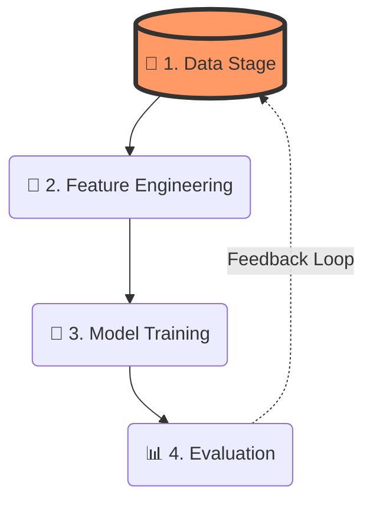

 [[Phase 2 (Roadmap)#^b5873f|The ML pipeline: data → features → model → evaluation → iterate]] | 
 
## The Big Picture: Why a Workflow?

The ML workflow is not a linear script you run once. It’s a **feedback loop**:




>[!abstract] The Golden Rule :
>Every project lives here. Ignore any step, and you’ll leak information, overfit, or solve the wrong problem. Today: **Data**—the foundation that determines 80% of your success.

---

# Part 1: Data – Where Everything Lives or Dies

> “Garbage in, gospel out? No. Garbage in, garbage out.” — every senior ML engineer

![[ML_Workflow.jpg|316]]

The **Data** stage answers: *What raw material do I have? What’s missing? What’s broken? How do I split it without cheating?*

## 🧩 Sub‑stages of “Data” (the detailed path)

| Step                     | What you do                                                                 | Common pitfalls                              |
| ------------------------ | --------------------------------------------------------------------------- | -------------------------------------------- |
| 1. Collection & assembly | Gather raw data from logs, APIs, sensors, databases, human annotation.      | Using the wrong time window; data missing at random vs. not at random. |
| 2. Exploration (EDA)     | Profile distributions, correlations, missingness, outliers, duplicates.     | Skipping visual checks; trusting summary stats blindly. |
| 3. Cleaning              | Handle missing values (impute, flag, delete), correct typos, remove duplicates, fix inconsistent units. | Deleting too much; introducing future information. |
| 4. Splitting             | Partition into **train / validation / test** sets (e.g., 70/15/15) while respecting temporal or group structure. | Random split when data is time‑series; data leakage from validation into training. |
| 5. Documentation         | Record data provenance, splits, cleaning decisions, and known biases.       | No documentation → unreproducible “science”. |

## 📘 Example: House Price Prediction (the classic)

Suppose you want to predict `sale_price` (target) from features like `sqft`, `bedrooms`, `year_built`, `zipcode`.

- <mark style="background: #ADCCFFA6;">Collection</mark>: Pull from county records + MLS listings. You realize some zip-codes have 10× more rows than others.  

- **<mark style="background: #ADCCFFA6;">EDA</mark>: Plot `sale_price` vs. `sqft` – obvious positive correlation. But `sale_price` shows a long tail (expensive mansions). Log‑transform? Later.

- **<mark style="background: #ADCCFFA6;">Cleaning</mark>: 5% of rows have missing `bedrooms` (older listings). Instead of dropping, you impute with median per `zipcode`. Two rows have `sqft = 0` – obvious errors → remove.  

- **<mark style="background: #ADCCFFA6;">Splitting</mark>: **Temporal split** – train on houses sold before 2019, validate on 2019, test on 2020. Why? Because you’re predicting future sales. Random split would leak future patterns into training – a cardinal sin.  

## 🧪 Detailed Path (a checklist you can follow for any project)

>[!todo] Checklist: Deployment Readiness

- [ ] **Inventory Sources:** CSVs, SQL, APIs, or Images?
- [ ] **Define Unit:** Is one row = one house? Or one user session?    
- [ ] **Leakage Check:** Is there a column available now that won't exist at prediction time?    
- [ ] **Missingness:** If >40% is missing, consider dropping unless `NA` has meaning.    
- [ ] **Split FIRST:** Do this before any scaling to prevent "data whispering."    
- [ ] **Data Card:** Document every decision in a Markdown table.

## 🔁 Interactive Obsidian Workflow for the “Data” Stage

I want you to *live* inside Obsidian while building ML systems. Here’s how to turn the Data stage into an interactive, reusable learning environment.

### <mark style="background: #FFF3A3A6;">1. Create a central “Workflow Hub” note</mark>

# 🗺️ ML Workflow Hub

> [!summary] Current focus: **Data** → see [[Data_Checklist]]
```dataview
TABLE stage, status, last_updated
FROM #ml-workflow
SORT file.ctime asc
```

- `#ml-workflow/data` – Data collection & cleaning
- `#ml-workflow/features` – (next lecture)
- `#ml-workflow/model`
- `#ml-workflow/eval`

Current focus: **Data** → see [[Data_Checklist]] and [[Leakage_Examples]].


### <mark style="background: #BBFABBA6;">2. Build a living **Data Checklist** note (using tasks + callouts)</mark>


> [!info] Project: House Price Prediction
## Collection
- [ ] Identify all raw data sources – see [[Sources_HouseData]]
- [ ] Verify time range covers at least 2 years (to model seasonality)
- [ ] Document access credentials (use environment variables, never hardcode)

## Exploration (EDA)
- [ ] Run `df.info()` and `df.describe()` – attach output to [[EDA_Outputs]]
- [ ] Plot histograms for each numeric column – store in `attachments/`
- [ ] Check for duplicated rows: `df.duplicated().sum()`
- [ ] Create a correlation matrix – identify highly correlated features

## Cleaning
- [ ] Handle missing values – decision log in [[Imputation_Log]]
- [ ] Remove rows with `sqft <= 0` (logged as `cleaning_errors.csv`)
- [ ] Standardise zipcode format (e.g., 5‑digit string)

## Splitting
- [ ] **Temporal split** if time‑series → define cutoff dates
- [ ] Or stratified split if classification → `train_test_split(..., stratify=y)`
- [ ] Save splits as three separate Parquet files: `train.parquet`, `val.parquet`, `test.parquet`

> [!danger] Never peek at the test set. I mean it.

### <mark style="background: #ABF7F7A6;">3. Use **callouts** to store key definitions and pitfalls</mark>

# Data_Leakage_Examples

> [!example] Real‑world leakage I saw at a fintech startup
> We used “average transaction amount in the next 7 days” as a feature to predict fraud. But that future data doesn’t exist at prediction time. The model “worked” in training → failed in production.

> [!tip] How to catch leakage
> Ask: “If I were making a prediction for a new house today, would I know this value for that house?”

### <mark style="background: #FF5582A6;">4. Embed a **dataview query** to show all notes tagged with `#data-cleaning`</mark>

# Data Cleaning Tracker

```dataview
LIST
FROM #data-cleaning
WHERE contains(file.tags, "#ml-workflow/data")
SORT file.mtime desc
```

Every time you encounter a new cleaning heuristic (e.g., “cap outliers at 99th percentile”), create a short note with that tag. The query will keep your library organised.

### <mark style="background: #D2B3FFA6;">5. Create **templates** for repeated use</mark>

Save this as `Templates/Data_Stage_Template.md`:


---
tags: [ml-workflow/data, data-cleaning, project/{{project_name}}]

---
# Data Stage – {{project_name}}

## Raw sources
- {{source1}}
- {{source2}}
## Target variable
`{{target_column}}` – type: regression / classification
## Cleaning decisions
- Missing in `{{col1}}`: imputed with `{{strategy}}`
- Removed rows: because {{reason}}
## Splits
- Train: {{start_date}} – {{end_date}}
- Val: ...
- Test: ...
## Known issues / biases
- e.g., underrepresented zipcode 90210
- 

Use **Templater** or the core template plugin to insert this when starting a new project.

### <mark style="background: #FFB8EBA6;">6. Visualise the learning workflow with **Canvas** (optional but powerful)</mark>

Create a Canvas file `ML_Workflow.canvas`:
- Node 1: **Data** → linked to `Data_Checklist`
- Node 2: **Features** (placeholder – we’ll build next lecture)
- Connect them with an arrow labelled “Cleaned data”

You can even embed images of your exploratory plots directly on the Canvas.

---

## 📚 Your assignment (to be done before next lecture)

1. Pick a small dataset (e.g., `sklearn.datasets.fetch_california_housing()` or a Kaggle competition with a CSV).
2. Create an Obsidian vault for this class.
3. Build the **Data** note using the template above. Fill it out completely.
4. Use the checklist – check off every step.
5. Write **three** callouts in a note called `Data_Reflections`, each describing one insight or surprise from your EDA.

> [!note] Next time: **Features** – we’ll engineer, select, and transform those raw columns into something a model can love.
